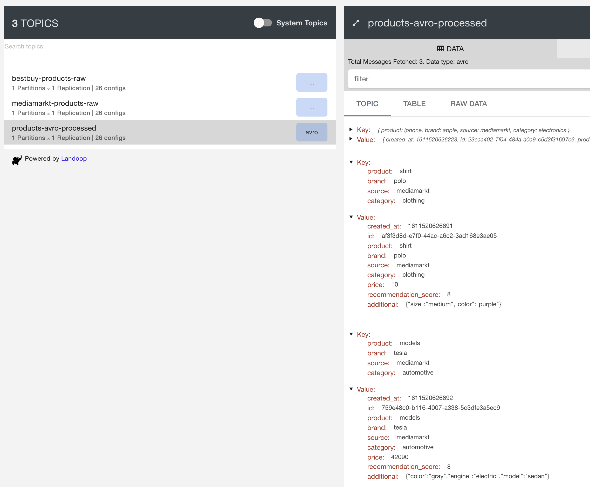
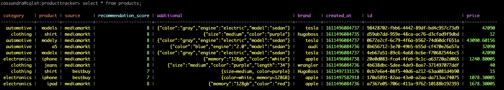
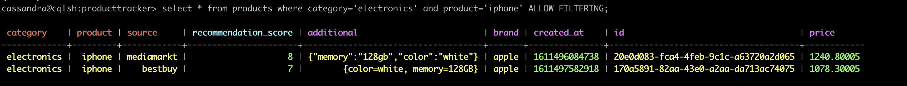
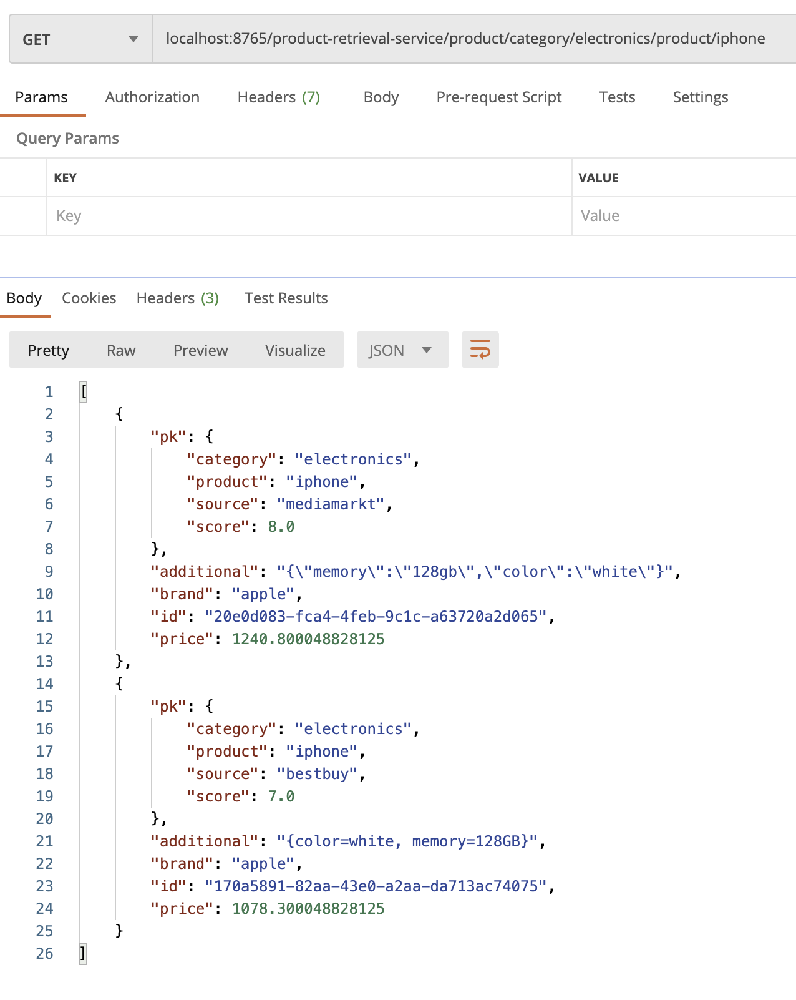
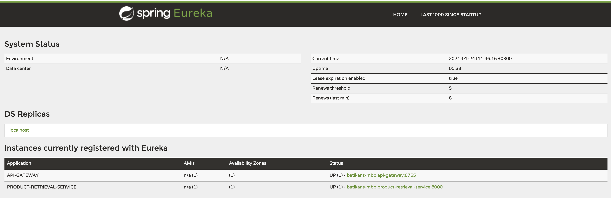

The aim of this project is to provide set of services that help the end customer to 
decide which website or retail shop they can use to buy their product by comparing data 
from different providers.


### Setup

#### Requirements

- Docker
- Gradle
- Java 8

##### 1 Run dockerized services

The project uses Apache Kafka and Cassandra services as docker containers. Run `docker-compose up` command to run containerized services. 
It takes about 3 to 5 minutes for all services to run on a computer. You should see `exit status 0; expected` in the terminal to proceed next step.
 
Kafka Cluster and related components can be monitored and managed by Landoop UI at `http://localhost:3030/`. This UI helps us to see topics, schemas and connectors.

Example  kafka cluster status view


Example topic view


Note: You can use `docker-compose down` command to stop services.

##### 2 Create topics and connectors in the container

Run `chmod +x init-cluster.sh` than `./init-cluster.sh` to create worker, topics and connectors.

Note: If streaming applications are run without the header being created, these applications will close itself shortly after running. 
Please make sure to create headers that the streamers will consume before moving on to the next step.

##### 3 Build and run spring boot applications

For building all applications use `gradle build` and after building run these applications with `gradle bootRun` command.
Thanks to the multi-project structure provided by gradle, it is enough to run these commands only once in the root directory.


### Usage

#### Load Data

There are two way to load data to the pipeline.

##### Using file

Added CSV formatted data to the [connector/source-file.csv](connector/source-file.csv) file. All data added to the file are considered to come from Mediamarkt provider. Added data is produced on mediamarkt-products-raw topic thanks to connectors.

category,brand,product,price,additional_information

additional_information must be a key value pair and it can be from zero to many. (i.e. engine,electric,color,gray,model,sedan)

###### Example data for text file.

```
electronics,apple,iphone,1240.8,color,white,memory,128GB
clothing,polo,shirt,10,size,medium,color,purple
clothing,HugoBoss,shirt,12,size,medium,color,purple
electronics,apple,ipad,1678.3,color,red,memory,128GB
clothing,Wrangler,jeans,40,size,medium,color,purple,length,34
automotive,audi,a5,32090,engine,2.0,color,blue,model,sedan
automotive,tesla,models,42090,engine,electric,color,gray,model,sedan
automotive,tesla,modelx,42090,engine,electric,color,gray,model,sedan
automotive,tesla,modelY,43090.6,engine,electric,color,gray,model,sedan
```

##### Using REST endpoint

Making POST request from the terminal to the "bestbut-products-raw" topic. All requests made are considered to be from Bestbuy provider.

###### Example data for REST Proxy.

```
curl -X POST -H "Content-Type: application/vnd.kafka.json.v1+json" \
      --data '  {
  "records": [{
    "value": {
      "category": "automotive",
      "brand": "tesla",
      "product": "modelY",
      "price": 43092.6,
      "additional": {
        "engine": "electric",
        "color": "gray",
        "model": "sedan"
      }
    }
  }]
}' "http://localhost:8082/topics/bestbuy-products-raw"
  {"offsets":[{"partition":0,"offset":0,"error_code":null,"error":null}],"key_schema_id":null,"value_schema_id":null}
```

```

curl -X POST -H "Content-Type: application/vnd.kafka.json.v1+json" \
      --data '{
  "records": [{
    "value": {
      "category": "clothing",
      "brand": "HugoBoss",
      "product": "shirt",
      "price": 15,
      "additional": {
        "size": "medium",
        "color": "purple"
      }
    }
  }]
}' "http://localhost:8082/topics/bestbuy-products-raw"
  {"offsets":[{"partition":0,"offset":0,"error_code":null,"error":null}],"key_schema_id":null,"value_schema_id":null}

```

```

curl -X POST -H "Content-Type: application/vnd.kafka.json.v1+json" \
      --data '{
  "records": [{
    "value": {
      "category": "electronics",
      "brand": "apple",
      "product": "iPad",
      "price": 1378.3,
      "additional": {
        "color": "red",
        "memory": "128GB"
      }
    }
  }]
}' "http://localhost:8082/topics/bestbuy-products-raw"
  {"offsets":[{"partition":0,"offset":0,"error_code":null,"error":null}],"key_schema_id":null,"value_schema_id":null}

```

#### Compare Product

User gets desired product from different providers such as web site and retail shops.
The result returns all information about product and user can compare data.

```
Endpoint: [GATEWAY]/product-retrieval-service/compare/category/[CATEGORY]/product/[product]
Type: GET

Example Query:
localhost:8765/product-retrieval-service/compare/category/electronics/product/iphone
```

### Technical Details

#### Pipeline of the project


#### Structure of the services

- Stream Services
    - File Stream Processor: Process the data coming from file.
    - Rest Proxy Stream Processor: Process the data comming through rest proxy.
- Backend Services
    - API Gateway: Spring Cloud API Gateway to be able to tracing, routing and load balancing.
    - Naming Service: Service discovery for API Gateway.
    - Product Retrieval Service: Retrieve products with name and category parameters.

#### Streaming

[Apache Kafka](https://kafka.apache.org/) is the backbone of the project. Thanks to kafka high available and high throughput system with easy scalability and maintainability. 
Not only Apache Kafka but also Kafka Streams and Kafka Connectors are used to generate robust architecture. 
    
#### Integration

The pipeline supports reading and writing various data sources thanks to [Kafka Connectors](https://docs.confluent.io/platform/current/connect/index.html) for importing new product data.
In the project *File Stream Connector* is used to read data from file and *Cassandra Connector* is used to write processed data to the Cassandra as persistent storage.
Moreover, data also can be send by through [Kafka Rest Proxy](https://docs.confluent.io/platform/current/kafka-rest/index.html).

According to the project structure, the raw data provided by all data providers will be written in a specific Kafka topic and a stream processing module will run for each raw topic. Stream processor configurations can be changed easily with config files.([File Streaming Config](stream-services/file-product-stream-processor/src/main/resources/application.properties), [REST Streaming Config](stream-services/rest-proxy-product-stream-processor/src/main/resources/application.properties)). On the other hand, all processed data written into the same topic to send cassandra database.

#### Validation and Enrichment

To be able to process the raw data written in the Kafka Topics, [Kafka Streams](https://docs.confluent.io/platform/current/streams/index.html) are used.
Stream processor, clean and validate data with basic checks, enrich it by adding timestamp and source information and convert it to [Apache Avro](https://avro.apache.org/) format by using models that automatically generated avro plugin.
Since products can have very different properties from each other, we put these properties as json in the additional field. 
At first we designed the system using map structure which is supported by both Avro and Cassandra. However, kafka connector does not allow maps, so we use json format for additional information.
All processed data is sent to the same topic with different source labels.

Another significant enrichment that applied to data is adding ML score of the provider. *(In this project, did not train any model, all scores is given constantly for demonstration purpose.)*

#### Storage

In this project, there are different data sources and different data structures. We are expecting high available system with massive data loads.
For these reasons, I choose [Cassandra](https://cassandra.apache.org/). Moreover, [Relayr](https://relayr.io/) uses it and during this project gives me an opportunity to learn it.
I choose following key structure;

- Category, product, source as primary key
- Recommendation score from machine learning model as clustering key

Category, product and source ensure uniqueness and recommendation score helps to clustering from high to low.
 n the other hand, I do not use source in the Rest API to decrease complexity. I is clear that this approach has some drawbacks on performance.

All data in database



Sample filtered data on database



If you want to connect database command as follows
```
docker exec -it cassandra bash
cqlsh -u cassandra -p cassandra
use producttracker;
select * from products;
select * from products where category='electronics' and product='iphone' ALLOW FILTERING;
```
#### Serving

Users can access our data using REST API. [Spring Boot](https://spring.io/projects/spring-boot) is used to handle these requests and database connection. 
Spring boot ease production ready app development with its architecture and modules such as load-balancer and cassandra connector.

Sample request and response




#### Service Discovery and Load Balancing

Spring Cloud API Gateway helps us to distribute coming request to the different services with implementing simple route path.
If there is more than one instances from the required service, gateway discover it thanks to service discovery and balance the load among the services.
[Netflix Eureka](https://spring.io/projects/spring-cloud-netflix) service discovery mechanism is used in this project.
These architecture helps us to use more robust system and when load is increased, we can easily handle it.

Service discovery page



#### Ports

| Service 	| Port 	|
|-	|-	|
| **Serving** 	  	|
| Eureka Service Discovery Web 	| 8761 	|
| API Gateway 	| 8765 	|
| Product Retrieval Service 	| 8000 	|
| **Kafka** 	  	|
| Kafka Broker 	| 9092 	|
| Kafka Rest Proxy 	| 8081 	|
| Kafka Schema Registry 	| 8082 	|
| Kafka Connect 	| 8083 	|
| Kafka Connect UI 	| 3030 	|
| **Data** 	  	|
| Cassandra 	| 9042 	|
| Cassandra Cluster Communication 	| 7000 	|

#### Future works
 - Elasticsearch can be added to retrieve related results.
 - Kubernetes scripts can be developed to run application on the Kubernetes Clusters.
 - More automation can be done to run application with a single command.
 - Use common module for gradle projects.
 - Testcontainers can be used for integration tests to test with kafka and cassandra instances.
